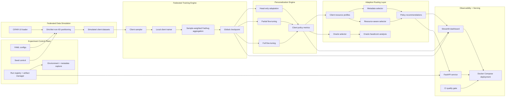

# FedAdaptOps

**FedAdaptOps** is research infrastructure for adaptive federated personalization: a modular ML systems platform for training, evaluating, routing, observing, and serving client-specific adaptation policies under heterogeneous resource constraints.

The project treats personalization as a systems decision problem:

> Which adaptation policy should each client receive, given its data distribution, compute budget, memory budget, latency constraint, bandwidth limit, and expected accuracy/cost tradeoff?

FedAdaptOps brings together non-IID federated training, per-client personalization, resource simulation, adaptive policy routing, experiment observability, API serving, Docker deployment, CI, automated tests, and reproducible artifact management in one coherent research engineering system.

---

## Why this project exists

Federated personalization is often presented as an algorithmic problem: implement FedAvg, fine-tune locally, report accuracy.

FedAdaptOps focuses on the infrastructure problem around that workflow.

Real adaptive ML systems need to answer questions like:

- How are non-IID client experiments made reproducible?
- How are personalization policies compared across heterogeneous clients?
- How are compute, memory, latency, bandwidth, and energy constraints represented?
- How does a system decide between head-only adaptation, partial fine-tuning, and full fine-tuning?
- How are routing decisions monitored, inspected, and served?
- How can research runs be turned into inspectable artifacts, dashboards, APIs, and deployment interfaces?

FedAdaptOps builds the surrounding research infrastructure needed to make adaptive personalization measurable, debuggable, and operationally inspectable.

---

## System capabilities

### Federated training infrastructure

- CIFAR-10 loading
- Dirichlet non-IID client partitioning
- reproducible seed control
- simulated federated clients
- sampled-client FedAvg
- sample-weighted aggregation
- optional client dropout simulation
- checkpointed global model
- round-level and client-level metrics
- persisted experiment artifacts

### Personalization engine

- `head_only`
- `partial_finetune`
- `full_finetune`
- layer-freezing utilities
- per-client personalization evaluation
- policy-level accuracy and cost metrics
- selector-ready `client_policy_metrics.csv`

### Adaptive routing engine

- metadata selector
- resource-aware selector
- oracle selector
- simulated client resource profiles
- compute, memory, latency, bandwidth, and energy constraints
- selector recommendation artifacts
- oracle headroom analysis

### Observability, API, and deployment

- Streamlit dashboard for experiment observability
- FastAPI service for run inspection and recommendations
- Dockerfile and Docker Compose
- GitHub Actions CI
- pytest suite
- ruff/black quality gates
- reproducibility docs
- API and deployment docs

---

## Architecture



Core artifact flow:

```text
configs/
  ↓
scripts/train_fedavg.py
  ↓
runs/<fedavg_run_id>/
  federated_round_metrics.csv
  client_round_metrics.csv
  checkpoints/global_round_best.pt

scripts/personalize.py
  ↓
runs/<personalization_run_id>/
  personalization_results.csv
  client_policy_metrics.csv

scripts/recommend_policies.py
  ↓
runs/<routing_run_id>/
  client_resource_profiles.csv
  selector_recommendations.csv
  selector_summary.csv
  oracle_headroom.csv

dashboard/API
  ↓
read local run artifacts
```

---

## Repository structure

```text
configs/                         Experiment configs
docs/                            Architecture, reproducibility, API, deployment docs
reports/                         Curated sample reports
scripts/                         CLI entrypoints
src/fedadaptops/
  api/                           FastAPI service and run registry
  clients/                       Federated client abstraction
  config/                        Typed config schemas and validation
  dashboard/                     Streamlit dashboard
  data/                          Dataset loading and non-IID partitioning
  evaluation/                    Metrics and reporting
  models/                        Model registry and SimpleCNN
  personalization/               Policy engine and freezing utilities
  resources/                     Client resource simulation
  selectors/                     Routing selectors and recommendation engine
  tracking/                      Artifacts, metadata, checkpoints, schemas
  training/                      FedAvg, aggregation, trainer
  utils/                         Seed/config utilities
tests/                           Unit and integration tests
```

---

## Quickstart

### 1. Create environment

```bash
python -m venv .venv
source .venv/bin/activate
pip install -e ".[dev]"
```

Windows PowerShell:

```powershell
python -m venv .venv
.venv\Scripts\Activate.ps1
pip install -e ".[dev]"
```

### 2. Run quality checks

```bash
pytest
ruff check .
black --check .
```

### 3. Run FedAvg

```bash
python scripts/train_fedavg.py --config configs/cifar10_fedavg.yaml
```

### 4. Run personalization

```bash
python scripts/personalize.py --config configs/cifar10_personalization.yaml
```

To personalize from a trained global model, set `personalization.checkpoint_path` in `configs/cifar10_personalization.yaml`:

```yaml
personalization:
  checkpoint_path: runs/<fedavg_run_id>/checkpoints/global_round_best.pt
```

### 5. Run adaptive routing

Edit `configs/cifar10_routing.yaml`:

```yaml
routing:
  personalization_results_path: runs/<personalization_run_id>/personalization_results.csv
```

Then run:

```bash
python scripts/recommend_policies.py --config configs/cifar10_routing.yaml
```

### 6. Launch dashboard

```bash
python scripts/launch_dashboard.py
```

Open:

```text
http://localhost:8501
```

### 7. Launch API

```bash
python scripts/serve_api.py
```

Open:

```text
http://localhost:8000/docs
```

---

## Docker deployment

```bash
docker compose up --build
```

Services:

```text
API:        http://localhost:8000
API docs:   http://localhost:8000/docs
Dashboard: http://localhost:8501
```

---

## Run artifacts

FedAdaptOps uses local artifact directories as the system backbone.

### FedAvg run

```text
runs/<run_id>/
  config.yaml
  environment.json
  run_metadata.json
  client_partitions.json
  partition_summary.csv
  federated_round_metrics.csv
  client_round_metrics.csv
  selected_clients.json
  summary.json
  checkpoints/global_round_best.pt
```

### Personalization run

```text
runs/<run_id>/
  personalization_results.csv
  client_policy_metrics.csv
  personalization_summary.json
  summary.json
```

### Routing run

```text
runs/<run_id>/
  client_resource_profiles.csv
  selector_recommendations.csv
  selector_summary.csv
  oracle_headroom.csv
  routing_summary.json
  summary.json
```

The dashboard and API read these artifacts directly.

---

## Engineering signals

FedAdaptOps demonstrates:

- reproducible ML experiment infrastructure
- config-driven execution
- deterministic non-IID client simulation
- modular federated training abstractions
- per-client personalization policy evaluation
- resource-aware decision systems
- multi-objective routing under deployment constraints
- oracle upper-bound comparison
- experiment observability
- API-based run inspection
- Dockerized local deployment
- automated testing and CI
- documentation discipline

---

## Scope and extension path

FedAdaptOps currently uses CIFAR-10 and a compact CNN to keep experiments fast, reproducible, and easy to inspect while exercising the full platform workflow.

The system is designed around stable interfaces rather than one-off experiments:

- config-driven execution
- deterministic non-IID partitioning
- persistent run artifacts
- client-level metrics
- policy-level personalization results
- resource profile simulation
- selector recommendation outputs
- dashboard/API ingestion
- Docker-based local deployment

Natural extensions include learned routing policies, contextual bandit selectors, richer resource models, additional datasets/models, MLflow or W&B integration, cloud execution, asynchronous jobs, and a persistent run registry.

---

## Status

FedAdaptOps is under active development as a flagship ML research engineering project.
