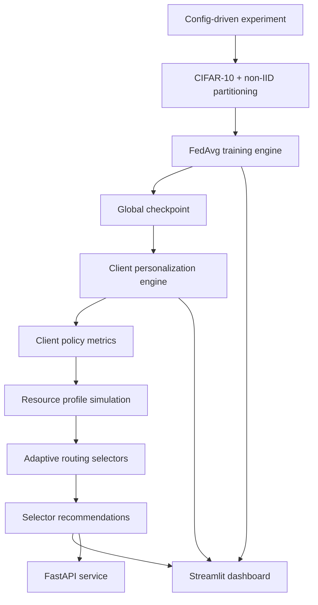

# FedAdaptOps

**FedAdaptOps** is a production-style, deployment-aware ML systems platform prototype for **adaptive federated personalization under heterogeneous client resource constraints**.

It is designed as a flagship research engineering project: not a toy algorithm repo, but a modular system connecting reproducible federated experiments, personalization policies, resource-aware routing, observability dashboards, API serving, and local deployment.

> **Central question:** How should AI systems dynamically choose personalization strategies across heterogeneous clients while balancing accuracy, compute cost, memory, latency, bandwidth, and resource constraints?

## Why this project exists

Most federated learning and personalization repositories focus on isolated algorithms or notebook experiments.

FedAdaptOps instead asks a systems question:

> What infrastructure is needed to evaluate, route, monitor, and serve adaptive personalization strategies across heterogeneous clients?

The project combines:

- **Research infrastructure thinking:** reproducibility, evaluation pipelines, experiment tracking, observability, modular tooling, reliable iteration loops.
- **Resource-aware personalization thinking:** heterogeneous clients, compute budgets, memory limits, latency constraints, bandwidth limits, and efficient on-device adaptation.

FedAdaptOps is not claiming big-tech-scale production readiness. It is intentionally framed as:

> **a production-style, deployment-aware ML systems platform prototype.**

## Current capabilities

### Federated training

- CIFAR-10 loading
- Dirichlet non-IID client partitioning
- reproducible seed control
- simulated clients
- sampled-client FedAvg
- sample-weighted aggregation
- optional client dropout simulation
- checkpointed global model
- round-level and client-level metrics

### Personalization engine

- `head_only`
- `partial_finetune`
- `full_finetune`
- layer freezing utilities
- per-client personalization evaluation
- selector-ready `client_policy_metrics.csv`

### Adaptive routing

- metadata selector
- resource-aware selector
- oracle selector
- simulated client resource profiles
- compute, memory, latency, bandwidth, and energy budgets
- selector recommendation artifacts
- oracle headroom analysis

### Dashboard, API, and deployment

- Streamlit dashboard for experiment observability
- FastAPI service for run inspection and recommendations
- Dockerfile and Docker Compose
- pytest suite and GitHub Actions CI

## Architecture



## Repository structure

```text
configs/                         Experiment configs
docs/                            Architecture, reproducibility, API, deployment docs
reports/                         Curated sample reports
scripts/                         CLI entrypoints
src/fedadaptops/
  api/                           FastAPI service and run registry
  clients/                       Federated client abstraction
  config/                        Typed config schemas and validation
  dashboard/                     Streamlit dashboard
  data/                          Dataset loading and non-IID partitioning
  evaluation/                    Metrics and reporting
  models/                        Model registry and SimpleCNN
  personalization/               Policy engine and freezing utilities
  resources/                     Client resource simulation
  selectors/                     Routing selectors and recommendation engine
  tracking/                      Artifacts, metadata, checkpoints, schemas
  training/                      FedAvg, aggregation, trainer
  utils/                         Seed/config utilities
tests/                           Unit and integration tests
```

## Quickstart

```bash
python -m venv .venv
source .venv/bin/activate
pip install -e ".[dev]"
pytest
```

Windows PowerShell:

```powershell
python -m venv .venv
.venv\Scripts\Activate.ps1
pip install -e ".[dev]"
pytest
```

## End-to-end demo

### 1. Run FedAvg

```bash
python scripts/train_fedavg.py --config configs/cifar10_fedavg.yaml
```

### 2. Run personalization

```bash
python scripts/personalize.py --config configs/cifar10_personalization.yaml
```

For serious runs, set `personalization.checkpoint_path` in `configs/cifar10_personalization.yaml` to:

```yaml
personalization:
  checkpoint_path: runs/<fedavg_run_id>/checkpoints/global_round_best.pt
```

### 3. Run adaptive routing

Edit `configs/cifar10_routing.yaml`:

```yaml
routing:
  personalization_results_path: runs/<personalization_run_id>/personalization_results.csv
```

Then run:

```bash
python scripts/recommend_policies.py --config configs/cifar10_routing.yaml
```

### 4. Launch dashboard

```bash
python scripts/launch_dashboard.py
```

Open:

```text
http://localhost:8501
```

### 5. Launch API

```bash
python scripts/serve_api.py
```

Open:

```text
http://localhost:8000/docs
```

## Docker

```bash
docker compose up --build
```

Services:

```text
API:        http://localhost:8000
API docs:   http://localhost:8000/docs
Dashboard: http://localhost:8501
```

## Run artifacts

FedAdaptOps uses local artifact directories as the system backbone.

FedAvg:

```text
runs/<run_id>/
  federated_round_metrics.csv
  client_round_metrics.csv
  selected_clients.json
  checkpoints/global_round_best.pt
```

Personalization:

```text
runs/<run_id>/
  personalization_results.csv
  client_policy_metrics.csv
  personalization_summary.json
```

Routing:

```text
runs/<run_id>/
  client_resource_profiles.csv
  selector_recommendations.csv
  selector_summary.csv
  oracle_headroom.csv
  routing_summary.json
```

## What this project demonstrates

- ML research infrastructure design
- reproducible experimentation
- modular federated learning systems
- adaptive personalization policy evaluation
- multi-objective routing under resource constraints
- observability and monitoring surfaces
- API-based experiment inspection
- deployment-aware engineering
- testing and documentation discipline

## Limitations

This is a local prototype, not a cloud-scale production system.

Current limitations:

- CIFAR-10 and SimpleCNN are used for fast iteration.
- Client simulation is local, not distributed across real devices.
- Resource profiles are simulated.
- Selector policies are heuristic/oracle baselines, not learned routing models yet.
- Security, authentication, and cloud deployment are out of scope.

## Future work

- learned routing policies
- contextual bandit selector
- richer resource model
- W&B or MLflow integration
- additional datasets/models
- privacy-aware metrics
- experiment comparison UI
- cloud deployment recipe
- asynchronous job execution
- SQLite run registry

## CV bullet

Built **FedAdaptOps**, a production-style adaptive federated personalization platform supporting non-IID client simulation, sampled-client FedAvg, resource-aware client routing, configurable personalization policies, oracle headroom analysis, Streamlit observability dashboards, FastAPI run inspection, Dockerized local deployment, automated testing, and reproducible ML infrastructure workflows.
