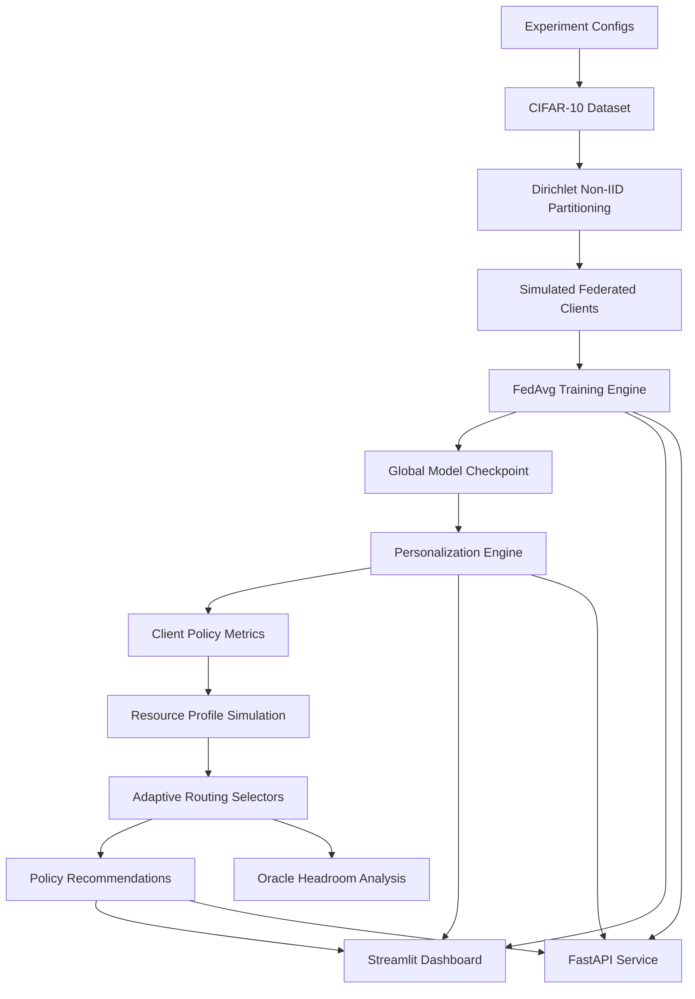

# FedAdaptOps Architecture

FedAdaptOps is a production-style ML research engineering platform prototype for adaptive federated personalization.

## System goal

The platform studies how a system should select personalization strategies across heterogeneous clients while balancing:

```text
accuracy
compute cost
memory budget
latency budget
bandwidth budget
energy budget
```

## High-level architecture



## Experiment lifecycle

```text
1. Load and validate config
2. Create run directory
3. Persist config, metadata, and environment
4. Prepare data and client partitions
5. Run training/evaluation
6. Save metrics continuously
7. Save summaries/checkpoints
8. Serve artifacts through dashboard/API
```

## Core artifact contract

```text
runs/<run_id>/
  config.yaml
  environment.json
  run_metadata.json
  summary.json
```

## Design principles

### Stable interfaces

Training, personalization, routing, API, and dashboard layers communicate through stable artifacts.

### Local-first reproducibility

Runs are fully inspectable through local files before requiring any external tracking service.

### Dashboard/API readiness

Metrics are saved in CSV/JSON formats that are easy to ingest from Streamlit, FastAPI, notebooks, or future databases.

### Deployment-aware realism

The project does not claim production readiness at big-tech scale. It demonstrates production-style architecture: configs, artifacts, APIs, deployment, tests, and docs.
